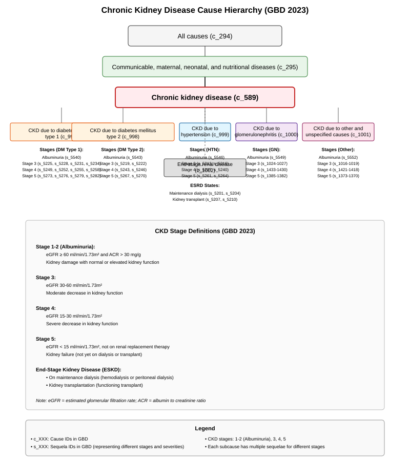
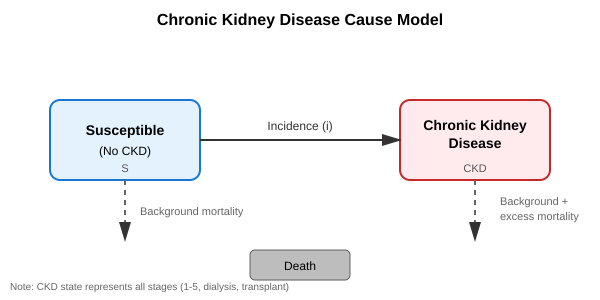

.. _2023_cause_ckd:

===================================
Chronic Kidney Disease: GBD 2023
===================================

.. contents::
   :local:
   :depth: 1

.. list-table:: Abbreviations
  :widths: 15 15 15
  :header-rows: 1

  * - Abbreviation
    - Definition
    - Note
  * - CKD
    - Chronic kidney disease
    -
  * - eGFR
    - Estimated glomerular filtration rate
    - Measured in ml/min/1.73m²
  * - ACR
    - Albumin to creatinine ratio
    - Measured in mg/g
  * - ESKD
    - End-stage kidney disease
    - Also known as end-stage renal disease (ESRD)
  * - RRT
    - Renal replacement therapy
    - Includes dialysis and kidney transplantation
  * - KDIGO
    - Kidney Disease: Improving Global Outcomes
    - International organization developing clinical practice guidelines

Disease Overview
----------------

Chronic kidney disease (CKD) is defined as abnormalities of kidney structure or function, present for more than 3 months,
with implications for health. [KDIGO-2024-CKD-Guidelines]_ CKD is characterized by a progressive and irreversible loss of
kidney function, as measured by estimated glomerular filtration rate (eGFR), and/or the presence of kidney damage, as
indicated by elevated urinary albumin to creatinine ratio (ACR) or other markers of kidney pathology.

The kidneys perform several critical functions including filtering waste products from the blood, regulating fluid and
electrolyte balance, producing hormones that control blood pressure, stimulating red blood cell production, and maintaining
bone health. When kidney function declines, waste products and fluid can build up in the body, leading to a variety of
complications including cardiovascular disease, anemia, bone disease, electrolyte imbalances, and ultimately kidney failure
requiring dialysis or transplantation. [NIH-NIDDK-CKD]_

CKD is a major global public health problem affecting approximately 850 million people worldwide. The main risk factors for
developing CKD include diabetes mellitus, hypertension, glomerulonephritis, cardiovascular disease, obesity, smoking, and a
family history of kidney disease. Many individuals with early-stage CKD are asymptomatic, making screening and early detection
crucial for prevention of disease progression. [Lancet-Global-Burden-CKD]_

Treatment strategies for CKD focus on slowing disease progression through management of underlying causes and risk factors
(such as blood glucose control in diabetes and blood pressure management), medications to reduce proteinuria (such as ACE
inhibitors or angiotensin receptor blockers), dietary modifications, and treating complications. Patients with advanced CKD
(stage 5) require renal replacement therapy, either dialysis (hemodialysis or peritoneal dialysis) or kidney transplantation,
to maintain life. [KDIGO-2024-CKD-Guidelines]_

GBD 2023 Modeling Strategy
--------------------------

In the Global Burden of Disease Study 2023, chronic kidney disease is defined as a permanent or chronic loss of kidney
function as indicated by estimated glomerular filtration rate (eGFR) and urinary albumin to creatinine ratio (ACR), or
receipt of renal replacement therapy.

GBD 2023 models six categories of prevalent CKD based on the degree of loss of kidney function or receipt of renal
replacement therapy [GBD-2023-CKD-Lancet]_:

1. **CKD stages I & II (Albuminuria)**: eGFR ≥ 60 ml/min/1.73m² and ACR > 30 mg/g
2. **CKD stage III**: eGFR 30-60 ml/min/1.73m²
3. **CKD stage IV**: eGFR 15-30 ml/min/1.73m²
4. **CKD stage V**: eGFR < 15 ml/min/1.73m², not on renal replacement therapy
5. **End-stage kidney disease on maintenance dialysis**
6. **Kidney transplantation** [GBD-2023-KFRT-Lancet-Global-Health]_

Modeling Approach
+++++++++++++++++

The GBD 2023 CKD estimation strategy builds upon methods developed in GBD 2017 and refined in subsequent rounds.
Prevalence estimates for each CKD stage were generated using DisMod-MR 2.1, a Bayesian mixed-effects meta-regression
modeling tool. Input data sources included:

- Population-based surveys with serum creatinine and/or urine albumin measurements
- Administrative claims data and health records
- Literature-based estimates of CKD prevalence and incidence
- Registry data for end-stage kidney disease, dialysis, and transplantation

For fatal CKD estimation, a standard CODEm (Cause of Death Ensemble model) approach with location-level covariates was used
to model deaths due to chronic kidney disease using vital registration data.

Bias adjustment methods utilize MR-BRT (meta-regression—Bayesian, regularized, trimmed) models to adjust for differences in
case definitions and study designs, allowing more direct comparisons between data sources.

Cause Hierarchy
+++++++++++++++

**Simplified hierarchy:**

- All causes (c_294)

  - Communicable, maternal, neonatal, and nutritional diseases (c_295)

    - **Chronic kidney disease (c_589)**

.. note::

   **Underlying etiology subcauses in GBD 2023:** GBD 2023 models CKD with underlying etiology subcauses including
   diabetes mellitus type 1 (c_997), diabetes mellitus type 2 (c_998), hypertension (c_999), glomerulonephritis
   (c_1000), other and unspecified causes (c_1001), and end-stage renal disease (c_1002). Each subcause includes
   sequelae for the different CKD stages (albuminuria/stages 1-2, stage 3, stage 4, stage 5) and ESRD includes
   sequelae for dialysis and transplantation. These underlying etiologies may be utilized in future Vivarium models
   if etiology-specific modeling is required for a particular project.

Severity Distribution
+++++++++++++++++++++

CKD severity is classified based on the stage of disease, which corresponds to the level of kidney function impairment.
The disability weights for CKD vary by stage:

.. list-table:: CKD Severity and Disability Weights
   :widths: 20 40 20
   :header-rows: 1

   * - CKD Stage
     - Description
     - Disability Weight Range
   * - Stages 1-2 (Albuminuria)
     - Kidney damage with normal or elevated eGFR
     - Lower disability (asymptomatic to mild)
   * - Stage 3
     - Moderate decrease in eGFR (30-59 ml/min/1.73m²)
     - Mild to moderate disability
   * - Stage 4
     - Severe decrease in eGFR (15-29 ml/min/1.73m²)
     - Moderate to severe disability
   * - Stage 5
     - Kidney failure (eGFR < 15 ml/min/1.73m²), not on RRT
     - Severe disability
   * - ESKD on dialysis
     - Requires regular dialysis treatments
     - Significant disability with treatment burden
   * - Kidney transplant
     - Functioning kidney transplant
     - Reduced disability compared to dialysis

.. note::

   Specific disability weights for each sequela are available in the GBD 2023 YLD appendix. Disability weights account
   for both the direct health impact of reduced kidney function and the burden associated with treatment requirements.

Restrictions
++++++++++++

The following table describes any restrictions in GBD 2023 on the effects of this cause (such as being only fatal or only
nonfatal), as well as restrictions on the ages and sexes to which the cause applies.

.. list-table:: GBD 2023 Cause Restrictions
   :widths: 15 15 20
   :header-rows: 1

   * - Restriction Type
     - Value
     - Notes
   * - Male only
     - False
     -
   * - Female only
     - False
     -
   * - YLL only
     - False
     - CKD causes both mortality and disability
   * - YLD only
     - False
     -
   * - YLL age group start
     - Post Neonatal
     - [28, 364 days), age_group_id=4
   * - YLL age group end
     - 95 plus
     - [95, 125 years), age_group_id=235
   * - YLD age group start
     - Early Neonatal
     - [0, 6 days], age_group_id=2
   * - YLD age group end
     - 95 Plus
     - [95, 125 years), age_group_id=235

Vivarium Modeling Strategy
--------------------------

Scope
+++++

This cause model for chronic kidney disease is designed to simulate the prevalence and burden of CKD in a population,
accounting for the different stages of disease severity. The model captures:

- Population distribution across CKD stages based on GBD 2023 prevalence estimates
- Cause-specific mortality associated with CKD at different stages
- Disability burden associated with each CKD stage
- The relationship between CKD and key risk factors (diabetes, hypertension, high BMI, etc.)

The model is designed to represent the steady-state prevalence of CKD stages in the population, with individuals assigned
to CKD states based on stage-specific prevalence estimates. CKD should occur in simulants at rates consistent with GBD 2023
incidence estimates, modified by relevant risk factor exposures.

The model does **not** explicitly simulate:

- Detailed disease progression between CKD stages over time (though age-related changes in prevalence are captured)
- Acute kidney injury episodes or their conversion to CKD
- Specific clinical interventions beyond renal replacement therapy (dialysis and transplantation)
- Quality of life impacts beyond GBD disability weights

Assumptions and Limitations
+++++++++++++++++++++++++++

**Key Assumptions:**

1. **Stage classification**: Simulants are assigned to CKD stages based on prevalence data rather than individual eGFR/ACR
   measurements. The model assumes that the GBD stage-specific prevalence estimates accurately represent the population
   distribution.

2. **Disease progression**: In the base model, progression between CKD stages is not explicitly modeled through transition
   rates. Instead, changes in CKD stage prevalence with age are captured through age-specific prevalence inputs. This
   approach assumes that the cross-sectional age-prevalence patterns adequately represent disease natural history for
   simulation purposes.

3. **Mortality**: Excess mortality from CKD is assumed to be captured by the stage-specific excess mortality rates (EMR)
   derived from GBD estimates. The model assumes that EMR adequately captures the elevated mortality risk associated with
   reduced kidney function and CKD complications.

4. **Risk factor relationships**: The model assumes that risk factor exposures (diabetes, hypertension, high BMI) affect
   CKD incidence but may not fully capture the complex bidirectional relationships between these conditions and CKD
   progression in real-world populations.

**Limitations:**

1. **Progression dynamics**: Without explicit progression rates between stages, the model may not accurately represent
   individual disease trajectories or the time spent in each CKD stage. This limitation is particularly important for
   intervention modeling where slowing progression is a key outcome.

2. **Treatment effects**: The model does not explicitly account for effects of CKD management interventions (such as RAAS
   inhibitors, SGLT2 inhibitors, or dietary modifications) on disease progression, though these effects may be implicitly
   captured in the GBD estimates if they reflect current treatment patterns.

3. **Acute events**: Acute kidney injury (AKI) episodes and their role in CKD development and progression are not modeled,
   which may underestimate the dynamic nature of kidney function changes in some populations.

4. **Granularity of stage 3**: CKD stage 3 is typically subdivided into 3A (eGFR 45-59) and 3B (eGFR 30-44) in clinical
   practice due to different risk profiles, but GBD models stage 3 as a single category. This may mask important heterogeneity
   in outcomes within this large group.

5. **Screening and diagnosis**: The model assumes that CKD prevalence estimates represent true disease prevalence rather
   than diagnosed prevalence, which may differ substantially in populations with limited access to screening and healthcare.

Cause Model Diagram
+++++++++++++++++++

State and Transition Data Tables
++++++++++++++++++++++++++++++++

Definitions
"""""""""""

.. list-table:: State Definitions
   :widths: 5 10 20
   :header-rows: 1

   * - State
     - State Name
     - Definition
   * - S
     - **S**\ usceptible to CKD
     - Simulant without chronic kidney disease (normal kidney function)
   * - CKD
     - Prevalent **CKD**
     - Simulant with chronic kidney disease at any stage

.. note::

   In a more detailed implementation, the CKD state could be subdivided into six sub-states corresponding to the six
   GBD categories: stages 1-2 (albuminuria), stage 3, stage 4, stage 5, dialysis, and transplant. For this base model,
   we represent CKD as a single aggregate state.

States Data
"""""""""""

.. list-table:: States Data
   :widths: 20 25 30 30
   :header-rows: 1

   * - State
     - Measure
     - Value
     - Notes
   * - All
     - cause-specific mortality (CSMR)
     - :math:`\frac{\text{deaths_c589}}{\text{population}}`
     - Post CoDCorrect cause-level CSMR
   * - S
     - prevalence
     - :math:`1 - \text{prevalence_c589}`
     - Calculated as complement of CKD prevalence
   * - CKD
     - prevalence
     - :math:`\sum\limits_{s \in \text{sequelae}} \text{prevalence}_s`
     - Sum over all CKD sequelae
   * - S
     - excess mortality rate
     - 0
     - No excess mortality for susceptible state
   * - CKD
     - excess mortality rate
     - :math:`\frac{\text{CSMR_c589}}{\text{prevalence_c589}}`
     - EMR = CSMR / prevalence
   * - S
     - disability weight
     - 0
     - No disability for susceptible state
   * - CKD
     - disability weight
     - :math:`\frac{1}{\text{prevalence_c589}} \times \sum\limits_{s \in \text{sequelae}} \text{disability_weight}_s \cdot \text{prevalence}_s`
     - Prevalence-weighted average of sequela-specific disability weights

Transition Data
"""""""""""""""

.. list-table:: Transition Data
   :widths: 10 10 10 20 30
   :header-rows: 1

   * - Transition
     - Source
     - Sink
     - Value
     - Notes
   * - i
     - S
     - CKD
     - :math:`\frac{\text{incidence_c589}}{1 - \text{prevalence_c589}}`
     - Incidence rate among susceptible population

.. note::

   GBD estimates incidence of CKD as a whole rather than stage-specific incidence rates. In this base model, incident
   cases transition from susceptible to the prevalent CKD state. In an expanded model with stage-specific states,
   incident cases would typically enter at earlier stages (stages 1-3) with stage-specific incidence rates.

Data Sources
""""""""""""

.. list-table:: Data Sources and Definitions
   :widths: 20 25 25 25
   :header-rows: 1

   * - Value
     - Source
     - Description
     - Notes
   * - prevalence_c589
     - como
     - Prevalence of chronic kidney disease (all stages)
     -
   * - deaths_c589
     - codcorrect
     - Deaths from chronic kidney disease
     -
   * - incidence_c589
     - como
     - Incidence of chronic kidney disease
     - Population incidence rate
   * - population
     - demography
     - Mid-year population for given age/sex/year/location
     -
   * - sequelae_c589
     - gbd_mapping
     - List of sequelae for chronic kidney disease
     - Includes all CKD stage sequelae across all underlying etiologies
   * - prevalence_s{sid}
     - como
     - Prevalence of sequela with id {sid}
     - Stage-specific prevalence
   * - disability_weight_s{sid}
     - YLD appendix
     - Disability weight of sequela with id {sid}
     - From GBD 2023 disability weight measurements

Validation Criteria
+++++++++++++++++++

1. **Prevalence validation**: Compare CKD prevalence experienced by simulants to post-COMO prevalence in GBD 2023 by age,
   sex, and location. Prevalence should match within expected sampling variation.

2. **Mortality validation**: Compare cause-specific mortality rate (CSMR) for CKD experienced by simulants to CoDCorrect
   CSMR in GBD 2023. CSMR should be consistent across age groups and over time.

3. **Incidence validation**: Verify that the incidence rate of new CKD cases matches GBD 2023 incidence estimates within
   acceptable tolerance.

4. **Disability validation**: Compare years lived with disability (YLD) rates from the simulation to GBD 2023 YLD estimates
   for CKD.

5. **Age pattern validation**: Ensure that age-specific prevalence patterns match expected epidemiological patterns, with
   increasing prevalence at older ages.

6. **Stage distribution**: If modeling CKD stages separately, validate that the distribution across stages matches GBD 2023
   stage-specific prevalence estimates.

References
----------

.. [KDIGO-2024-CKD-Guidelines]
   Kidney Disease: Improving Global Outcomes (KDIGO) CKD Work Group. KDIGO 2024 Clinical Practice Guideline for the
   Evaluation and Management of Chronic Kidney Disease. Kidney Int. 2024;105(4S):S117-S314.
   https://kdigo.org/wp-content/uploads/2024/03/KDIGO-2024-CKD-Guideline.pdf

.. [NIH-NIDDK-CKD]
   National Institute of Diabetes and Digestive and Kidney Diseases. Chronic Kidney Disease (CKD). Retrieved 2025.
   https://www.niddk.nih.gov/health-information/kidney-disease/chronic-kidney-disease-ckd

.. [Lancet-Global-Burden-CKD]
   GBD Chronic Kidney Disease Collaboration. Global, regional, and national burden of chronic kidney disease, 1990–2017:
   a systematic analysis for the Global Burden of Disease Study 2017. Lancet. 2020;395(10225):709-733.
   DOI: https://doi.org/10.1016/S0140-6736(20)30045-3

.. [GBD-2023-CKD-Lancet]
   GBD 2023 Chronic Kidney Disease Collaborators. Global, regional, and national burden of chronic kidney disease in
   adults, 1990-2023, and its attributable risk factors: a systematic analysis for the Global Burden of Disease Study 2023.
   Lancet. 2025. (In press)

.. [GBD-2023-KFRT-Lancet-Global-Health]
   GBD 2023 Kidney Failure with Replacement Therapy Collaborators. Global, regional, and national prevalence of kidney
   failure with replacement therapy and associated aetiologies, 1990–2023: a systematic analysis for the Global Burden
   of Disease Study 2023. Lancet Glob Health. 2025. DOI: https://doi.org/10.1016/S2214-109X(25)00198-6
